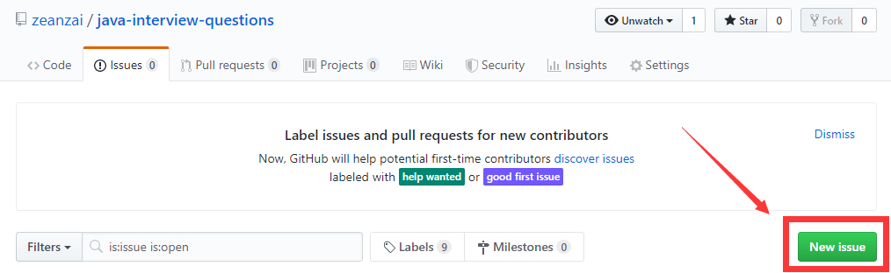

	<strong>Java突击面试问题大全，助你获得心仪Offer</strong>

    

## java突击面试问题大全

😃 本仓库是笔者在2019年跳槽找工作时收集的面试问题，内容丰富、涉及面广，面向初级、中高级几乎所有阶段的java程序员，希望能帮助大家快速准备java面试。

## 使用方法

😏 在阅读本仓库之前，可以先行阅读以下仓库内容，以求达到对java知识点的复习，最后再根据本仓库中的面试题目进行自测。

- [interviews](https://github.com/kdn251/interviews)
- 👍[advanced-java](https://doocs.github.io/advanced-java)
- [前端进阶之道](https://yuchengkai.cn/docs/frontend/)
- 👍[Java 学习/面试指南](https://snailclimb.top/JavaGuide)
- 👍[JCSprout](https://crossoverjie.top/JCSprout)
- 👍[CS-Notes](https://cyc2018.github.io/CS-Notes/)
- [architecture.of.internet-product](https://github.com/davideuler/architecture.of.internet-product)

## 如何贡献

😍本仓库致力于打造全网最全的java面试题库，所以热烈欢迎各种issue和pr。

- 提issue

- 提pr
  - fork本项目到自己的仓库
  - 把fork后的仓库克隆到本地
  - 修改代码
  - add并commit后，push到自己的仓库
  - 发起PR（pull request） 请求
  - 等待作者合并

## 说明

本文档基于[docsify](https://docsify.js.org/#/zh-cn/)创建，部署在GitHub Page上面。

## 其他项目

 
  <a href="https://github.com/zeanzai/Java-Linux" target="_blank">java-linux</a> 

   

  Java程序员的必备Linux运维技能，包括各种服务器软件的安装和运维等基本运维参考文档。

  <a href="https://zeanzai.me/Java-Linux/" target="_blank">快捷访问入口</a>

## License

